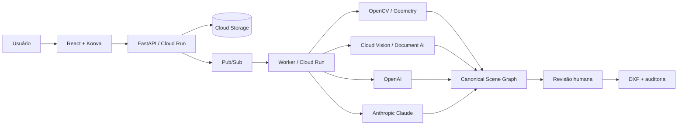

# Croquito

Croquito é um SaaS **AI First** para transformar levantamentos e croquis
manuscritos de engenharia, arquitetura e equipamentos urbanos em arquivos DXF
técnicos, revisáveis e auditáveis.

O produto não promete reconstrução automática infalível. Ele combina visão
computacional, OCR, dois modelos multimodais, regras geométricas e revisão humana
para reduzir o redesenho manual sem esconder incertezas.

## Estado atual

Status: três vertical slices locais executáveis do MVP.

O repositório já contém o scene graph tipado, contratos JSON Schema/TypeScript,
ingestão local de PDFs, propostas geométricas offline, revisão de cotas, solver
retangular, exportação DXF auditada, API mínima, shell web e CI. Os fluxos rodam
localmente via Docker e a homologação está no ar em GCP (Cloud Run). O fluxo
completo até CAD usa uma fixture sintética. Os documentos reais já podem ser
renderizados e preparados para revisão local, mas ainda não são enviados a
OCR/LLMs nem convertidos sem aprovação profissional.

Casos de demonstração:

- Fácil: Campo do Guaxindiba.
- Médio: Campo da Toca.
- Difícil: Praça Raul Campelo.
- Regressão: as 16 páginas fornecidas, sem copiar os PDFs de clientes para o Git.

## Arquitetura resumida



## Princípios

- Nenhuma cota é inventada.
- Toda geometria registra origem e precisão: `exact`, `derived`, `approximate`
  ou `unresolved`.
- Confiança declarada por um modelo não é probabilidade calibrada.
- Mudanças de modelo ou prompt passam por evals antes de produção.
- O DXF é auditado e renderizado novamente antes do download.
- Documentos do cliente, credenciais e respostas sensíveis não entram no Git.

## Comece por aqui

1. Leia [AGENTS.md](AGENTS.md) antes de trabalhar com um agente.
2. Use [docs/INDEX.md](docs/INDEX.md) para encontrar a fonte de verdade.
3. Consulte [docs/STATUS.md](docs/STATUS.md) para entender o marco atual.
4. Para produto, comece pelo [PRD](docs/product/PRD.md) e pelo
   [FDD](docs/product/FDD.md).
5. Para implementação, leia a
   [arquitetura](docs/architecture/SYSTEM_ARCHITECTURE.md), os
   [ADRs](docs/adr/README.md) e a
   [estratégia de testes](docs/engineering/TESTING_STRATEGY.md).

## Executar localmente

Pré-requisitos: Python 3.12, `uv`, Node.js 24, npm, Docker e Docker Compose.
Terraform é opcional (só para `make check` / `make infra-check`).

Instale as dependências e valide o repositório:

```bash
make setup
make check
make test
```

### Subir a aplicação com Docker

Os serviços locais (Postgres, floci e Keycloak) sobem em contêineres via Docker
Compose. Copie o `.env.local`, suba os serviços, crie o schema e rode a app:

```bash
cp .env.local.example .env.local
make dev-services   # docker compose -f docker-compose.local.yml up -d (Postgres, floci, Keycloak)
make db-init        # cria bucket, filas e schema locais
make dev            # API + web em paralelo
make dev-worker     # (opcional) consome uma mensagem da fila local
make down-services  # derruba os serviços quando terminar
```

Endereços de acesso após `make dev`:

| Serviço | URL |
|---|---|
| Web (Vite) | http://localhost:5173 |
| API (FastAPI) | http://localhost:8000 |
| Keycloak (OIDC) | http://localhost:8083 |

Postgres (`5432`) e o emulador AWS floci (`4566`) sobem via `make dev-services` e são usados pela
API; não é preciso acessá-los diretamente. `make dev` exige o `.env.local` copiado e os
serviços de pé (`make dev-services` + `make db-init`).

### Usuários e perfis locais

Identidade e papel vêm sempre do JWT (Keycloak) — o banco não guarda usuários, e
`make db-init` só cria o schema. Não há comando de "criar usuário do zero": três usuários
já vêm **importados com o realm** no `make dev-services` (Keycloak com `--import-realm`) e
o restante é criado por `make seed-users` (abaixo). Todos no tenant `tenant-local`, senha
`local-dev-only`, logáveis no browser em http://localhost:5173.

| Usuário | Papéis | Onde entra | Vem de |
|---|---|---|---|
| `engenheiro.local` | `engineer`, `tenant_admin` | croqui | realm |
| `orcamentista.local` | `orcamentista` | medição (e orçamento) | realm |
| `aprovador.local` | `aprovador` | orçamento (só assina) | realm |
| `arquiteto.local` | `architect` | croqui | `make seed-users` |
| `revisor.local` | `domain_reviewer` | croqui | `make seed-users` |
| `cad.local` | `cad_operator` | sem jornada na SPA | `make seed-users` |
| `operador.local` | `platform_operator` | API de administração (test token) | `make seed-users` |
| `tecnico.local` | `field_technician` | app de campo (PWA separada) | `make seed-users` |

**Os papéis que não vêm no realm.** Com os serviços de pé, um comando idempotente cria os
cinco usuários da metade de baixo da tabela:

```bash
make seed-users
```

Ele cria as roles que faltam no realm (`architect`, `domain_reviewer`, `field_technician`)
e habilita o atributo `tenant_id` na Admin API do Keycloak — sem isso o Keycloak 26
descarta o `tenant_id` e o usuário não consegue sessão. Como o Keycloak local não tem
volume persistente, rode de novo depois de um `make down-services`.

Atenção: nem todo papel tem tela na SPA. Só quem tem jornada aterrissa no app web —
`engineer`/`architect`/`domain_reviewer` no **croqui**, `orcamentista` na **medição**,
`orcamentista`/`aprovador` no **orçamento**. `platform_operator` é papel de **API** de
administração (use test token), `field_technician` é do **app de campo** (PWA separada) e
`cad_operator` não abre jornada — esses três logam no Keycloak mas mostram "sem jornada
liberada" na SPA, por design.

**Chamar a API direto como qualquer perfil (sem browser/Keycloak).** Para smoke ou
testes de rota — inclusive perfis sem usuário pronto, como `platform_operator` — ligue
`CROQUITO_ALLOW_TEST_TOKENS=true` no `.env.local` e mande um token de teste no header,
no formato `test:<tenant>:<subject>:<papéis-separados-por-vírgula>`:

```bash
curl -H "Authorization: Bearer test:tenant-local:op-1:platform_operator" \
  http://localhost:8000/v1/projects
```

O realm local desabilita direct access grants de propósito, então não há token por
senha fora do browser — o test token é o caminho para chamada direta. Mantenha a flag
em `false` fora do uso pontual.

Se precisar de um usuário sob medida além do `make seed-users`, crie-o na console do
Keycloak (http://localhost:8083, admin `local-admin` / `local-admin-only`), atribuindo a
role e o atributo `tenant_id`. Essas contas também somem no `make down-services`.

### Demos e evals determinísticas

Não exigem os serviços em Docker e não fazem chamadas externas:

```bash
make demo
make provider-contract-demo
make vision-eval
make solver-eval
```

`make demo` cria em `output/demo` um DXF R2018 em metros, preview renderizado a
partir do próprio DXF, auditoria JSON, quantitativos CSV, hipóteses e ZIP. Tudo em
`output/` é temporário e ignorado pelo Git.

`make provider-contract-demo` executa os contratos estruturados offline de OCR e
dos dois providers multimodais sobre uma imagem sintética. Ele produz somente um
pacote de revisão não exportável, com lineage de prompt/modelo; não usa
credenciais, SDKs nem envia documentos a serviços externos.

Para ingerir um PDF autorizado sem upload externo:

```bash
uv run croquito-demo ingest \
  --input "/caminho/arquivo.pdf" \
  --dataset-id "caso-local-v1" \
  --role "evaluation" \
  --output output/pdf
```

O comando não copia o PDF original. Ele gera páginas PNG, contact sheet e um
manifesto com digest e métricas. Veja o
[guia de desenvolvimento local](docs/engineering/LOCAL_DEVELOPMENT.md).

Após a ingestão, propostas CV não exportáveis podem ser geradas com:

```bash
uv run croquito-demo propose-dataset \
  --manifest output/pdf/caso-local-v1/manifest.json
```

O JSON resultante usa pixels, não metros. `quality_score` é um score heurístico,
não confiança calibrada, e toda proposta permanece `unresolved` e `export=false`.

`make solver-eval` demonstra o fluxo separado de cota revisada, constraint,
aprovação e DXF auditado. Em dados reais, uma leitura sem `HumanDecision` retorna
`review_required` e não cria cena métrica. Veja
[revisão de cotas e solver](docs/ai/MEASUREMENT_REVIEW_AND_SOLVER.md).

O shell web também apresenta os três níveis de demonstração - Guaxindiba, Toca e
Raul Campelo - como revisão bloqueada, e não como DXF já aprovado. Selecione
Fácil, Médio ou Difícil em `make dev` para comparar os tipos de pendência.

## Homologação

A homologação hospedada roda em GCP (Cloud Run), com Cloud Storage, Pub/Sub e banco
serverless. Detalhes de acesso e operação em
[operações/HML](docs/operations/HML.md).

## Escopo do MVP

Incluído:

- Upload privado de PDF.
- Processamento assíncrono e rastreável.
- Leitura independente por OpenAI e Claude, com Document AI / Cloud Vision como
  evidência auxiliar de OCR.
- Editor de revisão rápida.
- Geração de DXF R2018 em metros.
- Prévia, auditoria, quantitativos e registro de hipóteses.

Fora do MVP:

- Exportação DWG.
- Editor CAD completo.
- Conversão universal sem revisão.
- Comparação V1/V2.
- Acesso público irrestrito.

## Contribuição e segurança

Consulte [CONTRIBUTING.md](CONTRIBUTING.md) e [SECURITY.md](SECURITY.md).
