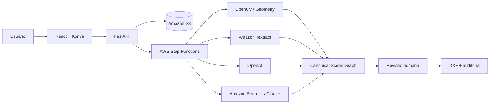

# Croquito

Croquito é um SaaS **AI First** para transformar levantamentos e croquis
manuscritos de engenharia, arquitetura e equipamentos urbanos em arquivos DXF
técnicos, revisáveis e auditáveis.

O produto não promete reconstrução automática infalível. Ele combina visão
computacional, OCR, dois modelos multimodais, regras geométricas e revisão humana
para reduzir o redesenho manual sem esconder incertezas.

## Estado atual

Status: três vertical slices locais executáveis do MVP.

O repositório já contém o scene graph tipado, contratos JSON Schema/TypeScript,
ingestão local de PDFs, propostas geométricas offline, revisão de cotas, solver
retangular, exportação DXF auditada, API mínima, shell web, Terraform AWS e CI. O
fluxo completo até CAD usa uma fixture sintética. Os documentos reais já podem ser
renderizados e preparados para revisão local, mas ainda não são enviados a
OCR/LLMs nem convertidos sem aprovação profissional.

Casos de demonstração:

- Fácil: Campo do Guaxindiba.
- Médio: Campo da Toca.
- Difícil: Praça Raul Campelo.
- Regressão: as 16 páginas fornecidas, sem copiar os PDFs de clientes para o Git.

## Arquitetura resumida



## Princípios

- Nenhuma cota é inventada.
- Toda geometria registra origem e precisão: `exact`, `derived`, `approximate`
  ou `unresolved`.
- Confiança declarada por um modelo não é probabilidade calibrada.
- Mudanças de modelo ou prompt passam por evals antes de produção.
- O DXF é auditado e renderizado novamente antes do download.
- Documentos do cliente, credenciais e respostas sensíveis não entram no Git.

## Comece por aqui

1. Leia [AGENTS.md](AGENTS.md) antes de trabalhar com um agente.
2. Use [docs/INDEX.md](docs/INDEX.md) para encontrar a fonte de verdade.
3. Consulte [docs/STATUS.md](docs/STATUS.md) para entender o marco atual.
4. Para produto, comece pelo [PRD](docs/product/PRD.md) e pelo
   [FDD](docs/product/FDD.md).
5. Para implementação, leia a
   [arquitetura](docs/architecture/SYSTEM_ARCHITECTURE.md), os
   [ADRs](docs/adr/README.md) e a
   [estratégia de testes](docs/engineering/TESTING_STRATEGY.md).

## Executar localmente

Pré-requisitos: Python 3.12, `uv`, Node.js 24, npm e Terraform.

```bash
make setup
make check
make test
make demo
make provider-contract-demo
make vision-eval
make solver-eval
```

`make demo` cria em `output/demo` um DXF R2018 em metros, preview renderizado a
partir do próprio DXF, auditoria JSON, quantitativos CSV, hipóteses e ZIP. Tudo em
`output/` é temporário e ignorado pelo Git.

`make provider-contract-demo` executa os contratos estruturados offline de OCR e
dos dois providers multimodais sobre uma imagem sintética. Ele produz somente um
pacote de revisão não exportável, com lineage de prompt/modelo; não usa
credenciais, SDKs nem envia documentos a serviços externos.

Para ingerir um PDF autorizado sem upload externo:

```bash
uv run croquito-demo ingest \
  --input "/caminho/arquivo.pdf" \
  --dataset-id "caso-local-v1" \
  --role "evaluation" \
  --output output/pdf
```

O comando não copia o PDF original. Ele gera páginas PNG, contact sheet e um
manifesto com digest e métricas. Veja o
[guia de desenvolvimento local](docs/engineering/LOCAL_DEVELOPMENT.md).

Após a ingestão, propostas CV não exportáveis podem ser geradas com:

```bash
uv run croquito-demo propose-dataset \
  --manifest output/pdf/caso-local-v1/manifest.json
```

O JSON resultante usa pixels, não metros. `quality_score` é um score heurístico,
não confiança calibrada, e toda proposta permanece `unresolved` e `export=false`.

`make solver-eval` demonstra o fluxo separado de cota revisada, constraint,
aprovação e DXF auditado. Em dados reais, uma leitura sem `HumanDecision` retorna
`review_required` e não cria cena métrica. Veja
[revisão de cotas e solver](docs/ai/MEASUREMENT_REVIEW_AND_SOLVER.md).

O shell web também apresenta os três níveis de demonstração - Guaxindiba, Toca e
Raul Campelo - como revisão bloqueada, e não como DXF já aprovado. Selecione
Fácil, Médio ou Difícil em `make dev` para comparar os tipos de pendência.

## Escopo do MVP

Incluído:

- Upload privado de PDF.
- Processamento assíncrono e rastreável.
- Leitura independente por OpenAI e Claude, com Textract como evidência auxiliar.
- Editor de revisão rápida.
- Geração de DXF R2018 em metros.
- Prévia, auditoria, quantitativos e registro de hipóteses.

Fora do MVP:

- Exportação DWG.
- Editor CAD completo.
- Conversão universal sem revisão.
- Comparação V1/V2.
- Acesso público irrestrito.

## Contribuição e segurança

Consulte [CONTRIBUTING.md](CONTRIBUTING.md) e [SECURITY.md](SECURITY.md).
