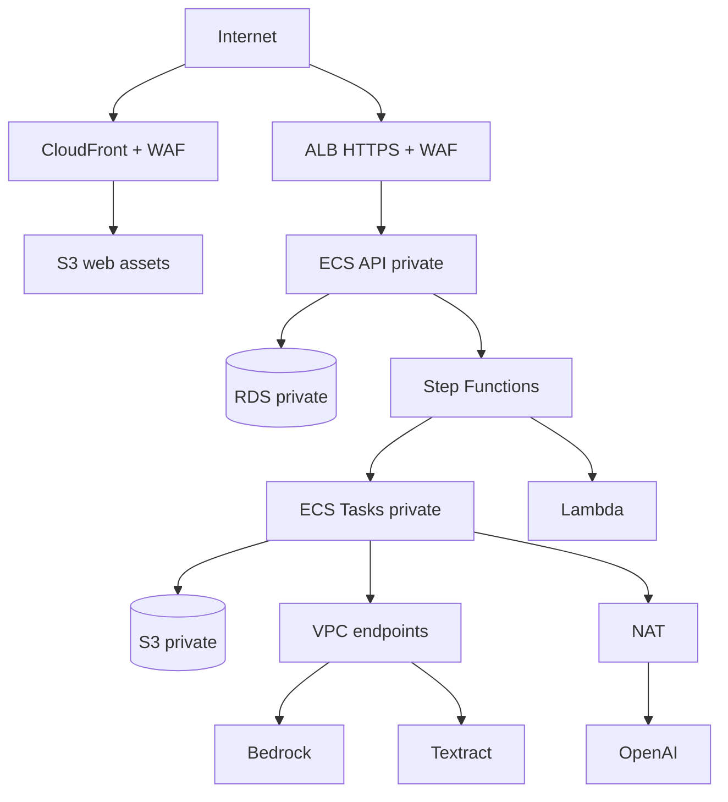

# Implantação AWS

Status: Accepted for MVP  
Responsável: Platform / Security  
Última revisão: 2026-08-21

> **Este documento descreve o desenho-alvo de produção em AWS, que nunca foi aplicado.**
> O que roda hoje é **GCP/Cloud Run**
> ([ADR-0025](../adr/0025-homologacao-em-gcp-cloud-run.md)), descrito em
> [HML](../operations/HML.md), e a infraestrutura que efetivamente o provisiona é o
> Terraform do repositório **`biahflow/infra`** — não o `infra/` deste repositório, que
> declara apenas recursos AWS nunca aplicados.
>
> O ADR-0002 continua valendo como decisão de produção registrada, e a escolha de produção
> permanece formalmente aberta: aposentá-la em favor do GCP é ato humano por ADR, não
> edição de documento.

## Região e processamento

- Região principal: `sa-east-1`.
- Inferência de Claude: perfil Bedrock global controlado.
- OpenAI: API externa via NAT.
- Não há garantia de residência exclusiva no Brasil.

## Topologia

## Serviços e responsabilidades

- Keycloak ou outro provedor OIDC: convite, login e JWT. A API depende apenas do
  contrato OIDC; o provedor pode ser hospedado fora da AWS.
- CloudFront/S3: SPA estática.
- ALB/ECS: API com autoscaling.
- Step Functions Standard: workflows e histórico.
- ECS RunTask/Fargate: CPU/memória de PDF, CV, solver e DXF.
- Lambda: tarefas curtas sem dependências nativas pesadas.
- RDS PostgreSQL: estado transacional.
- S3: blobs e lifecycle de sete dias.
- SQS DLQ/EventBridge: falhas terminais.
- CloudWatch/X-Ray: observabilidade.
- KMS/Secrets Manager/CloudTrail: segurança e auditoria.

## Contas e ambientes

Preferência: contas AWS separadas para `staging` e `production`. No MVP, se houver
uma conta única, usar VPCs, buckets, KMS keys, secrets e roles distintos. Nunca
compartilhar banco ou prefixo de objetos.

## Rede

- API e tasks em subnets privadas.
- RDS sem rota pública.
- Security groups com menor privilégio.
- VPC endpoints para S3, ECR, Logs, Secrets, Bedrock e Textract quando suportado.
- NAT restrito à saída necessária; sem inbound.

## IAM

- Uma role por workload.
- Worker recebe somente acesso ao prefixo do job.
- API pode presignar, mas não invocar modelos diretamente.
- Step Functions pode iniciar somente task definitions aprovadas.
- Deploy role separada de runtime roles.

## Dados

- S3 SSE-KMS e block public access.
- RDS encryption, backups e TLS.
- Signed URLs de até 15 minutos.
- Lifecycle S3 de sete dias.
- Lambda de limpeza reconcilia banco e objetos órfãos.
- Bedrock invocation payload logging desabilitado.

## Escala e custo

- API autoscaling por CPU/request count.
- Fargate tasks sob demanda por stage.
- Sem Fargate Spot para golden/demo path.
- Budgets e alarmes de erro/custo.
- Métrica `estimated_cost_usd` por page/provider.

## Terraform

- Estado remoto criptografado e lock.
- Plan em revisão; apply exige aprovação.
- Módulos por boundary, sem valores secretos.
- Tags obrigatórias: `service`, `environment`, `owner`, `data_classification`.

## Continuidade

- RDS automated backup conforme [Disaster Recovery](../operations/DISASTER_RECOVERY.md).
- S3 não usa versionamento para documentos efêmeros.
- Infra reproduzível por Terraform; exports podem ser regenerados de revisão ainda
  retida.
