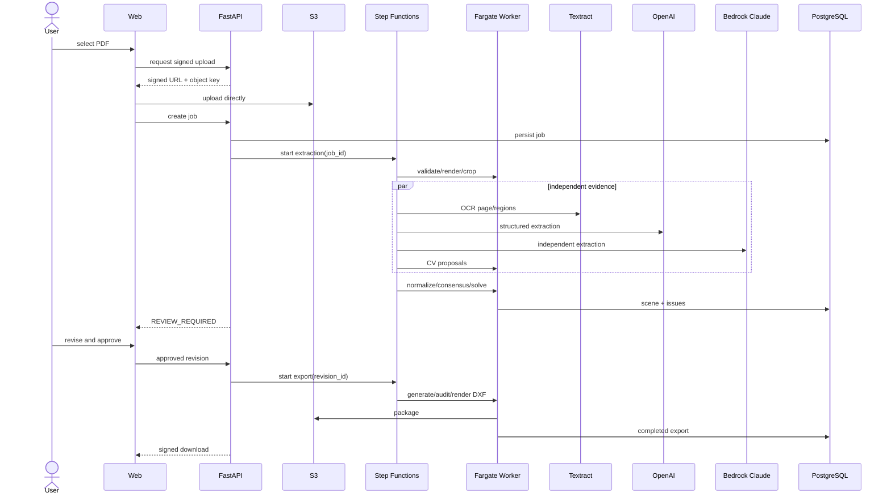

# Fluxo de dados

Status: Accepted for MVP  
Responsável: Architecture / Data / AI  
Última revisão: 2026-08-10

## Fluxo principal



## Artefatos por etapa

| Etapa | Entrada | Saída | Persistência |
|---|---|---|---|
| Upload | PDF | objeto original | S3, 7 dias |
| Render | PDF | PNG por página | S3, 7 dias |
| Region proposal | PNG | regiões e CV candidates | PostgreSQL/S3 |
| OCR | PNG/recortes | palavras, linhas, boxes | PostgreSQL, 7 dias |
| LLM extraction | PNG/recortes | `ProviderReading` | PostgreSQL, 7 dias |
| Consensus | readings | medidas/associações/issues | PostgreSQL |
| Solve | candidates/constraints | `SceneRevision` | PostgreSQL |
| Proposal calibration | duas linhas CV + cena solucionada | transform versionado pixel→metro | PostgreSQL |
| Proposal decision | proposta + calibração confirmada | revisão e entidade `approximate` ou rejeição auditada | PostgreSQL |
| Approval | revisão editada | revisão congelada | PostgreSQL |
| Export | revisão congelada | DXF/PNG/JSON/CSV/ZIP | S3, 7 dias |

## Coordenadas

- Artefatos locais de visão e revisão preservam pixels da imagem fonte para
  inspeção reproduzível. A persistência de produção normaliza também as evidências
  para `[0,1]`, mantendo largura, altura, rotação e transform inversa.
- Scene graph usa coordenadas locais em metros.
- O transform pixel→modelo é versionado por revisão.
- Uma página pode ter mais de um `DrawingRegion`, mas somente uma planta principal
  por sistema de coordenadas no MVP.

## Minimização de dados

- Enviar somente a página/recorte necessário aos modelos.
- Não incluir nome do cliente ou caminho S3 no prompt.
- Preferir bytes/URL temporária sem acesso público.
- Respostas brutas expiram com o projeto.
- Métricas persistentes usam apenas contagens, duração, modelo e custo.

## Idempotência

Cada artefato derivado tem chave lógica:

```text
tenant_id / project_id / job_id / page_id / stage / input_digest / version
```

Repetir a mesma etapa com o mesmo digest retorna ou substitui somente o artefato
daquela tentativa, nunca cria outra entidade de domínio silenciosa.

## Exclusão

`DELETE /v1/jobs/{id}` marca `DELETING`, revoga downloads e inicia remoção de S3,
readings, cenas e exports. Métricas agregadas sem conteúdo podem permanecer.
