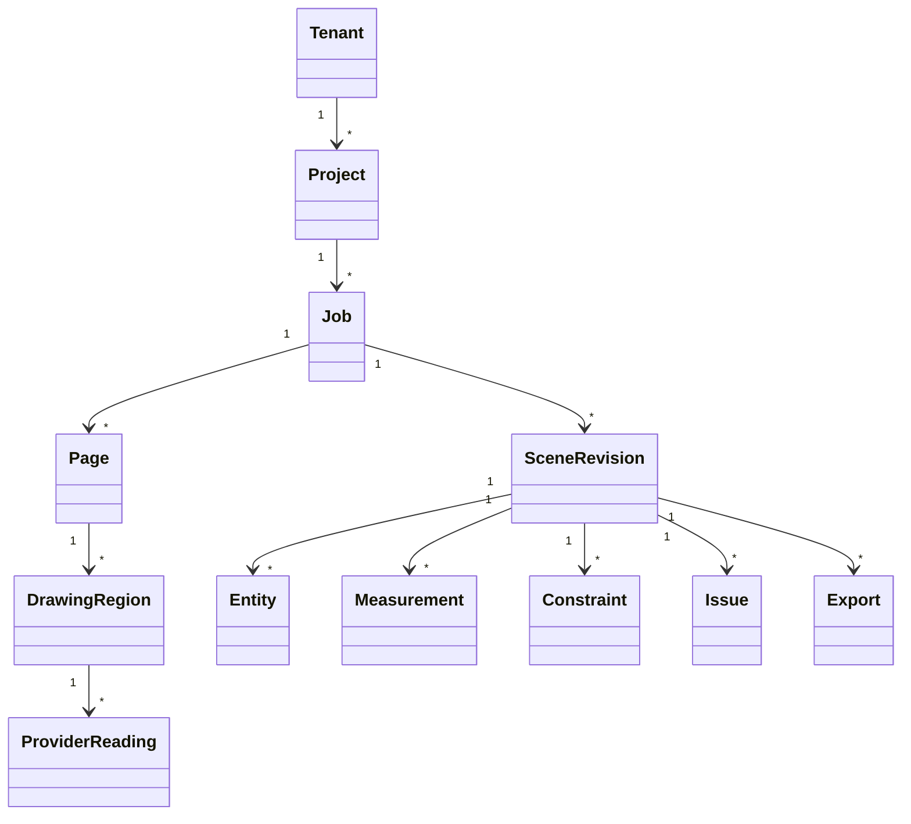

# Modelo de domínio

Status: Accepted for MVP  
Responsável: Architecture / Backend / Geometry  
Última revisão: 2026-08-12

## Agregados



## Entidades

### `Project`

Agrupa documentos e lifecycle de retenção. Pertence exatamente a um tenant.

Campos essenciais: `id`, `tenant_id`, `name`, `default_unit`, `expires_at`,
`created_by`, `created_at`.

### `Job`

Uma tentativa de processar um documento. Guarda estado, execution ARN, versões do
pipeline e falha terminal normalizada.

### `TenantAiProcessingEntitlement`

Autorização contratual por tenant para provedores externos. Guarda estado ativo ou
revogado, referência lógica do contrato, operador da plataforma e timestamps. Não
é administrada por usuários de revisão.

### `AiProcessingAuthorization`

Snapshot imutável no job que referencia o entitlement contratual ativo e registra
provedores, processamento global e retenção. O worker exige tanto esse snapshot
quanto o entitlement ainda ativo antes de chamar provedores reais.

### `Page`

Metadados da página renderizada: dimensões, rotação, digest e objeto S3. Não guarda
bytes no banco.

### `DrawingRegion`

Área semântica: `main_plan`, `detail`, `material_list` ou `ignored`. Toda região
ignorada registra origem da classificação e decisão humana quando aplicável.

### `ProviderReading`

Observação imutável de um provedor:

- `provider`, `model_id`, `prompt_version`.
- `raw_text`, valor normalizado e unidade.
- bounding polygon e `region_id`.
- entidade/feature candidata.
- schema version e status de validação.
- usage, latency e error code sem payload sensível em logs.

### `SceneRevision`

Snapshot completo e imutável após persistência. Uma nova edição cria nova revisão
com `parent_revision_id`. Aprovação define `approved_at` e `approved_by`; não há
edição posterior.

### `ProposalCalibration`

Snapshot de revisão que liga duas propostas CV de linha a duas entidades de linha
`exact`/`derived` não paralelas. Guarda IDs dos anchors, orientação, revisão de
cena de origem, transform de similaridade pixel→metro e resíduo. É evidência de
posicionamento visual, não provenance suficiente para precisão `exact`.

### `VisionProposalSet`

Observação de visão computacional (ou de extração por provider) em pixels da página,
com ids `vp_…` estáveis por proposta. É versionada por revisão de leitura, não por
conta própria: cada `review_revisions.proposals_json` carrega um snapshot completo,
imutável dentro daquela revisão. Refinar a geometria de uma proposta — sem mudar o que
ela é nem sua identidade — nunca edita o snapshot vigente; produz uma revisão de leitura
nova que copia decisões e evidência intactas, recomputa os candidatos de associação
contra a geometria nova e revalida (ou descarta) qualquer calibração pixel→metro pela
mesma regra usada nas decisões da API ([ADR-0019](../adr/0019-proposal-refresh-creates-a-new-review-revision.md)).
Uma proposta continua `unresolved`/`export=false` em qualquer snapshot: o refino nunca
promove precisão, só melhora a geometria que a revisão humana ainda vai decidir sobre.

### `Entity`

Tipos MVP:

```text
line, polyline, polygon, rectangle, circle, arc, spline,
text, dimension, block_instance
```

Campos invariantes: geometry, layer, precision, provenance, source regions e
export policy.

### `Measurement`

Valor dimensional separado da entidade. Suporta `length`, `width`, `height`,
`radius`, `diameter`, `angle`, `count` e `note`.

Preserva `raw_text`, precisão decimal escrita, unidade original e valor SI.

### `Constraint`

Tipos: `distance`, `coincident`, `horizontal`, `vertical`, `parallel`,
`perpendicular`, `closed`, `radius`, `diameter`, `symmetry`.

Origem: `measured`, `user_confirmed`, `domain_rule` ou `visual_proposal`.
`visual_proposal` nunca é suficiente para classificar entidade como `exact`.

### `Issue`

Severidade: `info`, `warning`, `critical`. Códigos são estáveis e legíveis por
máquina; mensagem é traduzível. Issues apontam para entidades, medidas, readings e
regiões.

### `Export`

Deriva exatamente de uma revisão aprovada. Guarda formato, version, digest,
auditoria, objetos S3 e estado.

## Classificação de precisão

| Valor | Regra |
|---|---|
| `exact` | Solução única a partir de medidas/constraints confirmados. |
| `derived` | Calculada de entidades exatas, com regra registrável. |
| `approximate` | Ajustada visualmente e aceita explicitamente. |
| `unresolved` | Sem informação ou decisão suficiente. |

## Invariantes

- `exact` exige provenance de medida/constraint confirmada.
- `unresolved` relevante impede aprovação.
- `approximate` exige aceitação humana antes do export.
- Proposta CV aceita gera somente entidade `approximate`, com IDs da proposta e
  da calibração na provenance; uma proposta rejeitada permanece auditável.
- Medida nunca é sobrescrita por resultado do solver.
- Decisão de leitura nunca é editada nem apagada. Corrigi-la é um ato humano novo, que
  cria uma `HumanDecision` sucessora com `rectifies_decision_id` apontando a anterior,
  numa revisão de leitura nova; a decisão substituída permanece legível na revisão em que
  foi tomada. A leitura não volta a `proposed`, e a associação é sempre redeclarada
  ([ADR-0022](../adr/0022-declared-rectification-of-review-decisions.md)).
- Geometria que ainda se apoia numa decisão corrigida não é reprojetada nem descartada:
  a cena nova recebe a issue crítica `READING_DECISION_SUPERSEDED` com as entidades
  afetadas e o export fica bloqueado até o traçado ser refeito.
- Constraint conflitante produz issue; não é descartada silenciosamente.
- Export aponta para revisão aprovada e imutável.
- Tenant de todos os filhos coincide com o agregado raiz.
- Valores internos geométricos usam metros e radianos.
- Arredondamento é somente de apresentação.

## Versionamento

- Schemas usam `schema_version` semântico.
- Mudança incompatível requer migração e nova versão de contrato.
- Provider readings permanecem no schema recebido e são adaptadas ao schema
  interno versionado.
