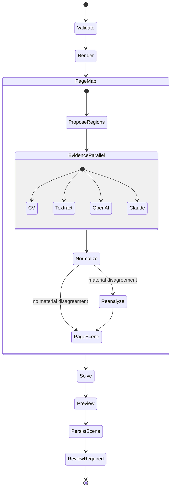
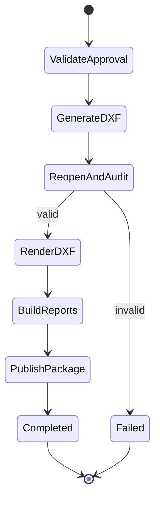

# Workflows de processamento

Status: Accepted for MVP  
Responsável: Backend / Worker / Infra  
Última revisão: 2026-08-10

## Por que duas state machines

Revisão humana pode durar horas. A extração termina em `REVIEW_REQUIRED`; a
exportação inicia somente após aprovação. Isso evita execução longa aguardando
callback e separa reprocessamento de publicação.

## Extraction state machine

## Export state machine

## Políticas de falha

| Etapa | Retry | Falha após retry |
|---|---|---|
| S3/serviço AWS transitório | 3, exponencial+jitter | `FAILED` ou branch degradada |
| Textract | 3 | issue warning; continuar |
| Um LLM | 3 | issue critical; sem auto-confirmação |
| Dois LLMs | 3 | job `FAILED` |
| CV/solver determinístico | 1 retry de infraestrutura | job `FAILED` com diagnóstico |
| Reanálise regional | 2 | revisão humana obrigatória |
| Auditoria DXF | sem retry cego | export `FAILED` |

Erros de schema, autorização ou input não são transitórios.

## Idempotência

- Execution name deriva de `job_id + workflow_version`.
- Fargate tasks usam stage token e input digest.
- Writes usam upsert condicionado à versão.
- Publicação usa temporary key e move lógico somente após auditoria.
- Repetir export da mesma revisão e versão retorna o mesmo digest.

## Timeouts

- Cada provider call possui connect/read timeout explícito.
- Fargate task tem limite por etapa e heartbeat quando suportado.
- State machine completa não excede a janela de retenção.
- Timeout vira código de domínio, não stack trace ao usuário.

## Eventos

EventBridge captura `FAILED`, `TIMED_OUT` e `ABORTED`, envia resumo à SQS DLQ e
aciona alarmes. Payload contém IDs e código, nunca conteúdo do documento.

## Reprocessamento regional

Nova análise registra `analysis_id`, crop digest e parent readings. Ela atualiza
candidates somente ao criar uma nova SceneRevision; não muta cena aprovada.

