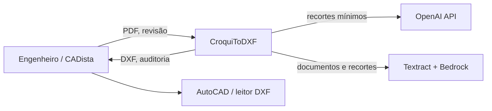
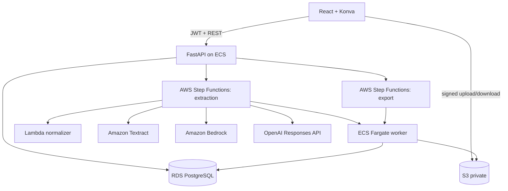

# Arquitetura do sistema

Status: Accepted for MVP  
Responsável: Architecture / Engineering  
Última revisão: 2026-08-10

## Objetivos arquiteturais

- Separar observação probabilística de solução geométrica determinística.
- Preservar provenance de imagem até DXF.
- Permitir reprocessar uma região sem repetir o job inteiro.
- Tornar falhas, custos e decisões humanas auditáveis.
- Manter fornecedores de IA substituíveis.

## Contexto

## Containers

## Componentes internos

### API

- Autorização e isolamento de tenant.
- Lifecycle de projetos, jobs e revisões.
- URLs assinadas e validação de comandos.
- Início das máquinas de estado.
- Controle otimista de revisões.

### PDF/vision worker

- Renderização, orientação e recortes.
- Propostas de linhas, contornos, círculos e regiões.
- Nenhuma proposta vira entidade exata sem solver/provenance.

### Provider adapters

- `OpenAIProvider`, `BedrockClaudeProvider`, `TextractProvider`.
- Entradas/saídas internas iguais.
- Timeout, retry e erro normalizado.
- Nenhum SDK de fornecedor fora do adapter.

### Consensus engine

- Normalização de números e unidades.
- Match entre leituras e regiões.
- Divergências estruturadas.
- Roteamento para reanálise ou HITL.

### Geometry engine

- Constrói e resolve o scene graph.
- Classifica precisão.
- Detecta subdeterminação e conflito.
- Não conhece HTTP nem SDKs de IA.

### DXF exporter

- Mapeia scene graph aprovado para CAD.
- Gera, reabre, audita e renderiza.
- Publica somente pacote válido.

## Fronteiras de confiança

1. Browser é não confiável: tenant e permissões são verificados na API.
2. PDF é não confiável: validado e processado sem privilégios.
3. Modelo é não confiável: schema, consenso e regras determinísticas.
4. Revisão humana é autorizada, mas versionada e validada.
5. Export é derivado: nunca aceita entidade fora da revisão congelada.

## Princípios de evolução

- Monorepo com contratos compartilhados, sem acoplamento de runtime.
- Eventos e tarefas usam IDs, não payloads grandes.
- S3 guarda blobs; PostgreSQL guarda estado e metadados.
- Step Functions guarda orquestração; não é banco de domínio.
- Mudança transversal exige ADR.

## Referências

- [Data Flow](DATA_FLOW.md)
- [Domain Model](DOMAIN_MODEL.md)
- [AWS Deployment](AWS_DEPLOYMENT.md)
- [ADRs](../adr/README.md)

